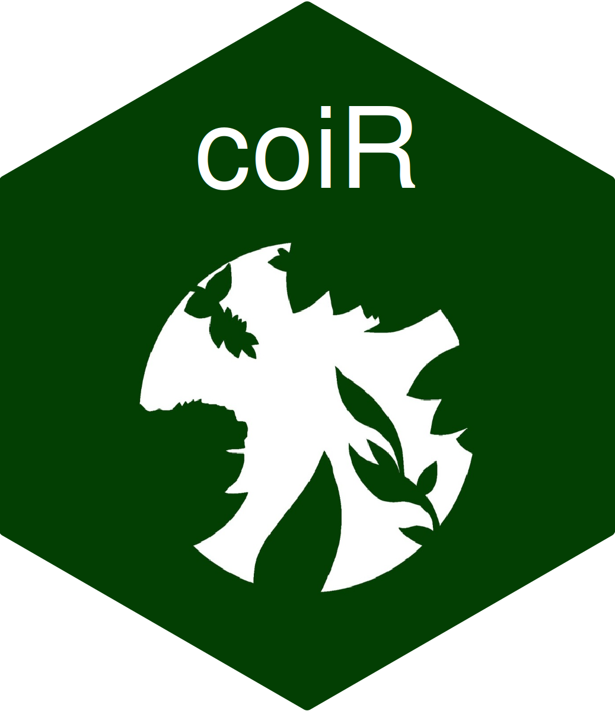

# Olá!

- 📍 Pernambucano
- 🧑‍🎓 Biólogo Bacharel – [Universidade Federal de Pernambuco, Brasil](https://www.ufpe.br)
- 🧑‍🎓 Estudante de Mestrado – [Programa de Pós-Graduação em Biologia Animal, Universidade Federal de Pernambuco, Brasil](https://sites.ufpe.br/ppgba)
- 🐸 Herpetólogo brasileiro – [Laboratório de Herpetologia (LHERP), Universidade Federal de Pernambuco, Brasil](https://sites.ufpe.br/herpetologia)
- ♻️ Pesquisador de Ecologia & Biodiversidade
- 💻 Programdor em R & #rstats
- 📈 Interessado em ciência de dados de biodiversidade e ambiental
- 📊 Fundador da [Bionalises](https://beacons.ai/bionalises), mentor e consultor de ciência de dados

# Principais ferramentas de R

 
  
  
  
  
  
  
  
  
  
  
  

# Pacotes criados

# Contatos

 
  
  
  
  
  
  

# Cheque meus principais repositórios

- [Tutorial: Analysing Canopy Openness Index Analysis with R](https://github.com/Edbbioeco/Canopy-Openness-Index-Analysis-with-R)
- [Tutorial: How to download high resolution satellite images with R](https://github.com/Edbbioeco/how_to_download_satellite_images_with_R)
- [Tutorial: Calculating coordinates based on Azimuth degrees and distances with R](https://github.com/Edbbioeco/Calculating-coordinates-using-Azimuth-degrees-and-distances_with-R)
- [Built package: Ordering species abundance by gradients by {ordenaR}](https://github.com/Edbbioeco/ordenaR)
